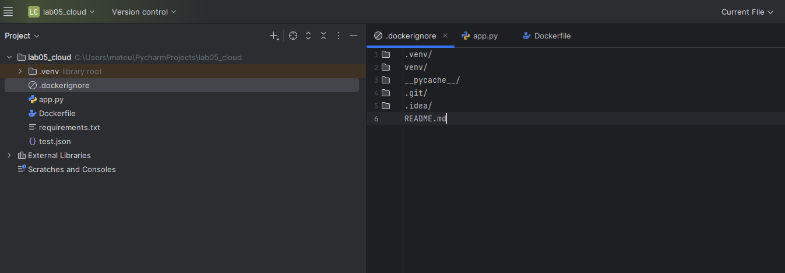
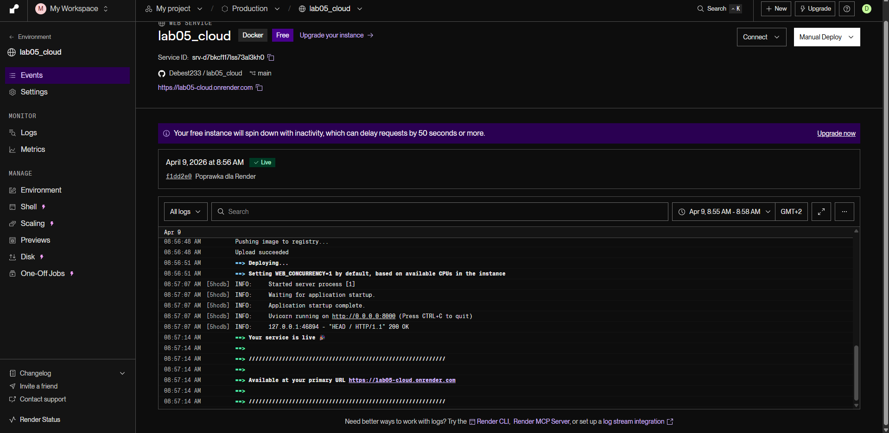
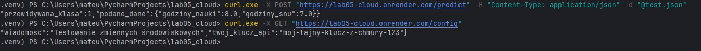
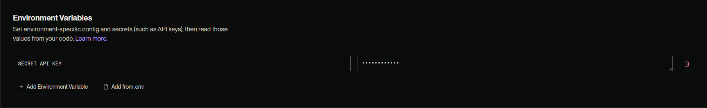

# Laboratorium 05 - Wdrożenie modelu ML w chmurze (Render.com)

Repozytorium zawiera rozwiązanie zadań z Laboratorium 5.
git add .
## Zadanie 4: Porównanie wdrożeń (Serverless vs Własny serwer)

| Cecha | Serverless (np. Render, Cloud Run) | Własny serwer (VPS / Bare metal) |
| :--- | :--- | :--- |
| **Zarządzanie (Ops)** | Brak potrzeby zarządzania serwerem i systemem — wszystko robi za nas platforma. | Trzeba samemu dbać o system, aktualizacje, bezpieczeństwo i certyfikaty SSL. |
| **Skalowanie** | Automatyczne — aplikacja dostosowuje się do ruchu (może się nawet „wyłączyć”, gdy nikt nie korzysta). | Ręczne — trzeba samemu zwiększać zasoby lub konfigurować dodatkowe serwery. |
| **Wydajność** | Może wystąpić tzw. „cold start” — pierwsze zapytanie po przerwie działa wolniej. | Brak tego problemu — serwer działa cały czas. |
| **Koszty** | Płaci się tylko za użycie (często dostępna darmowa opcja na start). | Stały koszt co miesiąc, niezależnie od użycia. |
| **Kontrola** | Ograniczona — mamy dostęp głównie do aplikacji. | Pełna kontrola nad całym serwerem i jego konfiguracją. |

## Zadanie 5: Zmienne środowiskowe

Aplikacja została rozszerzona o obsługę zmiennych środowiskowych (np. klucza API) przy użyciu modułu `os`.  
Zmienna `SECRET_API_KEY` została ustawiona w panelu platformy Render w zakładce *Environment*, dzięki czemu nie znajduje się bezpośrednio w kodzie. To zwiększa bezpieczeństwo, ponieważ poufne dane nie są widoczne w repozytorium.
---
## Dokumentacja wykonania zadań (Zrzuty ekranu)

### Środowisko lokalne

### Wdrożenie aplikacji Render

### Konfiguracja ukrytej zmiennej środowiskowej
